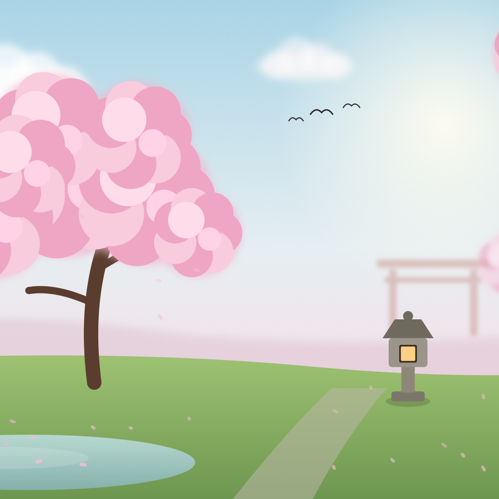
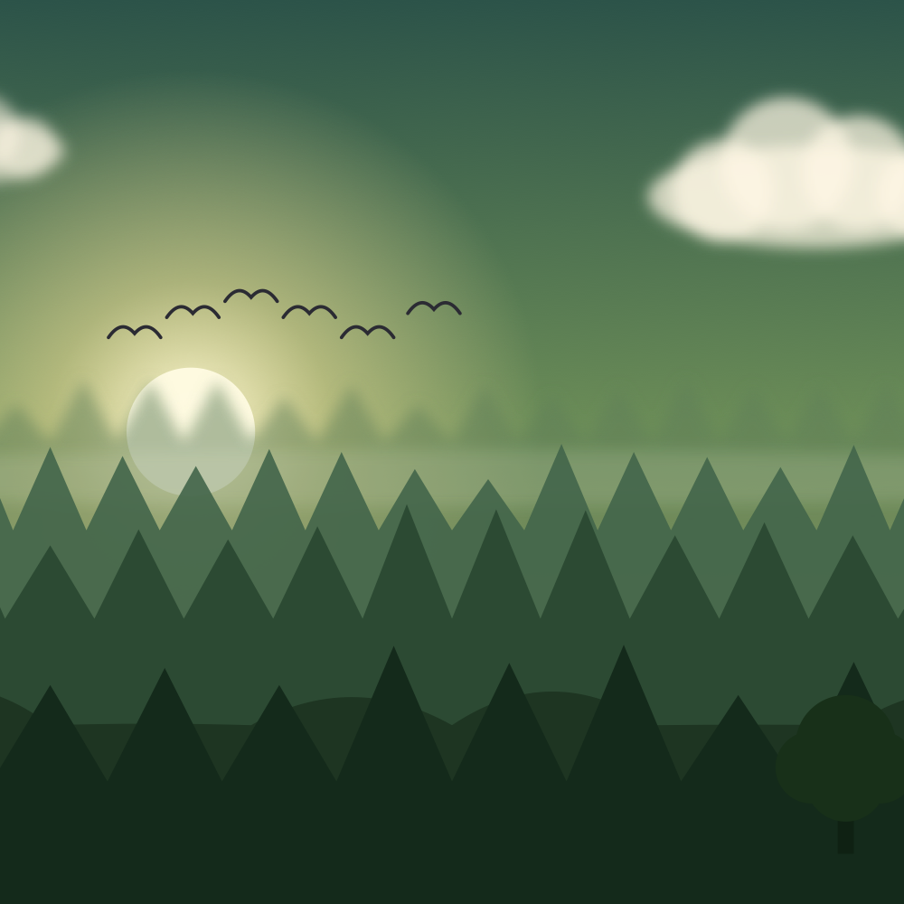
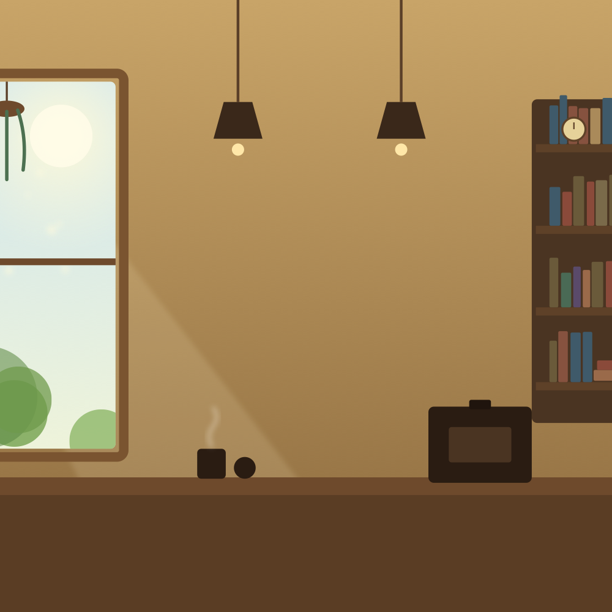
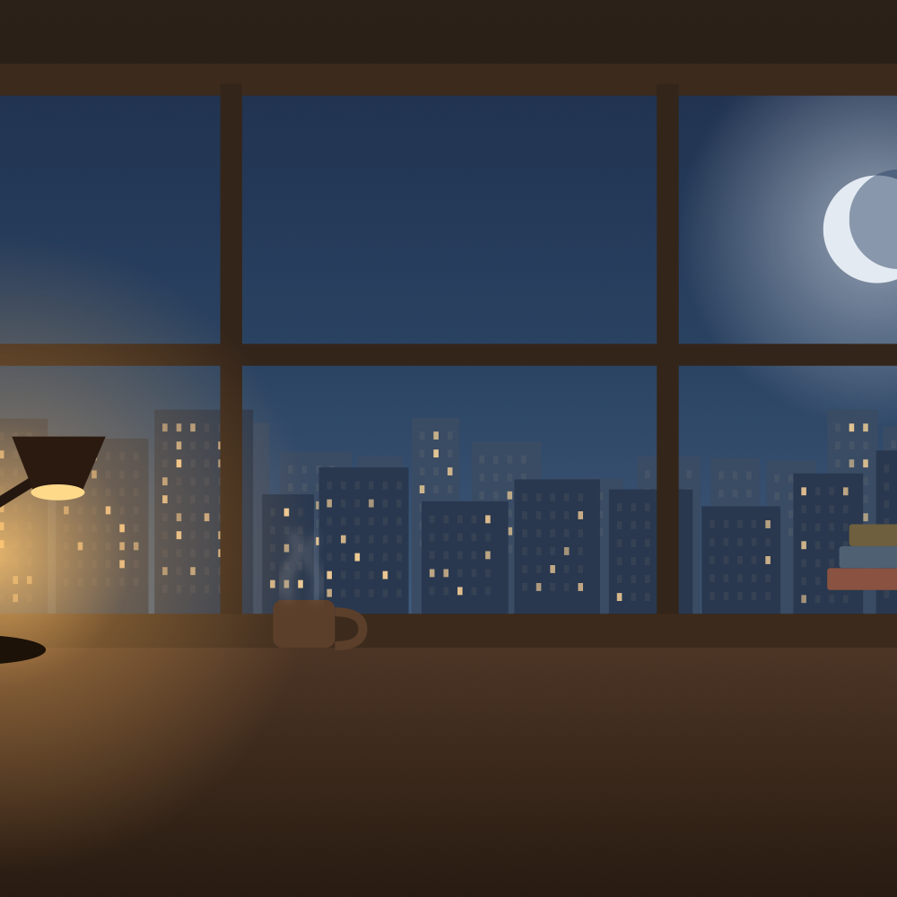
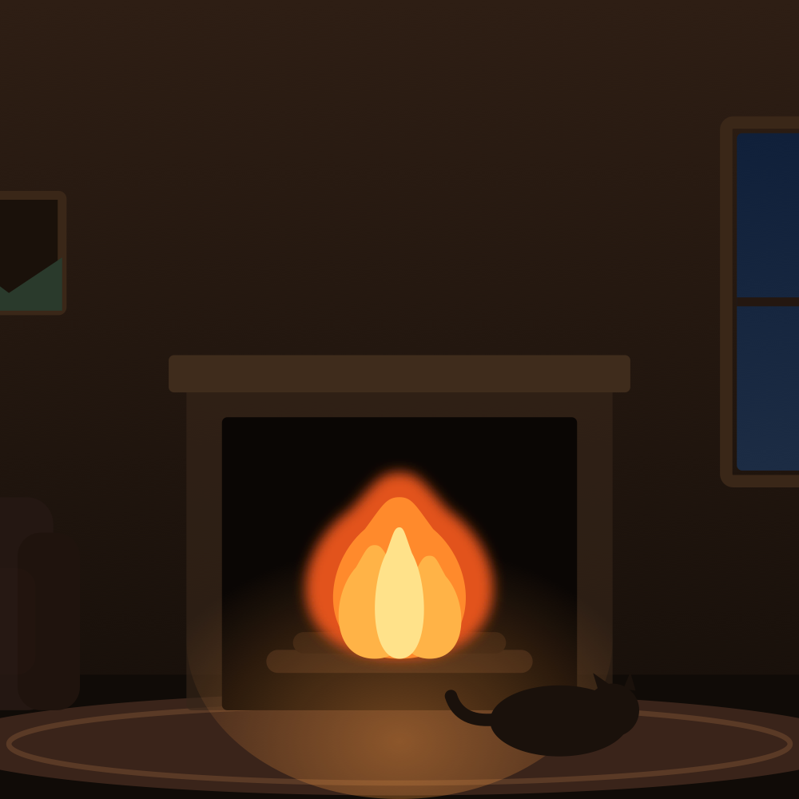

# 静室 · Still Room

**可切换场景的沉浸式自习室** —— 进入任一场景自动播放对应的自然白噪音，配合极简专注工具，帮你安放此刻的专注。

*An immersive, switchable-scene study room. Each scene auto-plays a matching procedurally-generated soundscape, paired with minimal focus tools. Pure front-end, zero dependencies, installable PWA.*

### [▶ 在线体验 · Live Demo](https://ziyi125229.github.io/still-room/)

---

## ✨ 特点 · Features

- **6 个场景**，按一天的光线排列：晨光森林 · 樱花庭院 · 午后咖啡馆 · 海边日落 · 雨夜书房 · 壁炉雪夜
- **双视觉模式**：每个场景都能在「手绘插画」与「真实照片」之间一键切换
- **程序化白噪音**：全部用 Web Audio 实时合成（**无任何音频文件**）——雨声 / 海浪 / 篝火 / 森林 / 咖啡馆 / 樱花风铃，可「跟随场景」自动播放，也可关掉后**多音轨自由叠加混音**
- **氛围动效**：Canvas 粒子 —— 雨丝 / 落雪 / 光尘 / 海面波光 / 樱花翻飞 / 篝火火星
- **5 个专注工具**（面板可拖动、记忆位置）：番茄钟（今日计数 · 刷新不中断 · 完成通知 · 与待办联动）、正计时、今日要事（点文字可编辑 · 标记“正在做”）、呼吸调息（4-7-8 / 箱式）、声音混音
- **自定义背景**：为任意场景上传自己的图片
- **极简抗干扰**：鼠标静止自动隐藏界面，全屏沉浸
- **PWA**：可「添加到主屏幕」像 App 一样打开，离线可用
- **键盘快捷键**：空格起停番茄 · 数字 1–6 切场景 · Esc 关面板 · F 全屏

## 🏞 场景一览 · Scenes

| 🌲 晨光森林 | 🌸 樱花庭院 | ☕ 午后咖啡馆 |
|:---:|:---:|:---:|
|  |  |  |
| 🌊 **海边日落** | 🌧 **雨夜书房** | 🔥 **壁炉雪夜** |
|  |  |  |

> 上图为手绘插画版；每个场景另有一套真实照片版可一键切换。

## 🚀 使用 · Usage

直接用浏览器打开 [在线链接](https://ziyi125229.github.io/still-room/)，点「进入」解锁声音即可（浏览器要求先有一次点击才能播放音频）。

手机扫码即开，还能「添加到主屏幕」当 App 用：

**离线 / 分享**：仓库自带 `build-offline.js`，运行 `node build-offline.js` 会把场景图片内嵌、打包成一个可双击离线打开、随手分享的单文件 HTML。

## 🛠 技术 · Tech

- 单个 `index.html`（HTML + CSS + JS 内联）+ `img/` 场景照片，零依赖
- 场景插画：手写内联 SVG；动效：Canvas
- 声音：Web Audio API 程序化合成
- 离线 / 安装：Web App Manifest + Service Worker

## 📜 License

[MIT](LICENSE)

## 🙏 致谢

真实场景照片来自 [Pexels](https://www.pexels.com)（免费可商用授权）。

---

如果它让你更专注了，欢迎点一颗 ⭐ · If it helps you focus, a ⭐ is appreciated.

